# Tableau Homework Assignment
## CitiBike Data Analysis

## Overview of Project

### Total Ridership Over Time and Split between Customers and Subscribers

Here, I have a graph that shows overall ridership over the time period sampled.  Overall ridership is the green line on top.  Then the ridership is split between single ride customers and subscribers.  You can clearly see in this image that the subscribers to CitiBike are their major source of ridership and that there are significantly fewer customers than subscribers.

 

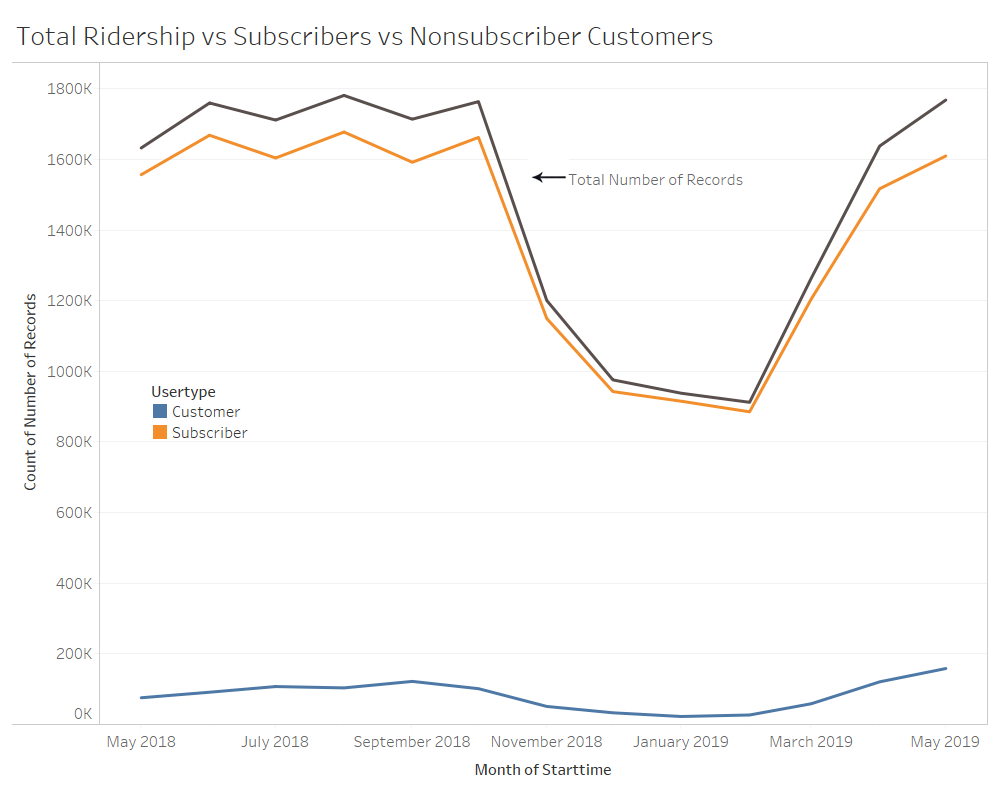

### Percent Change in Ridership Over Time
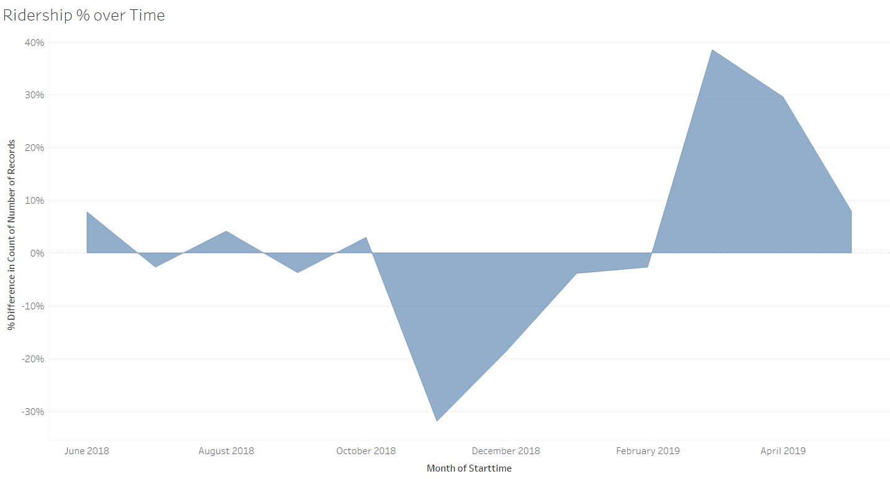

### Analysing bikes by ID likely due for inspection and service.
  
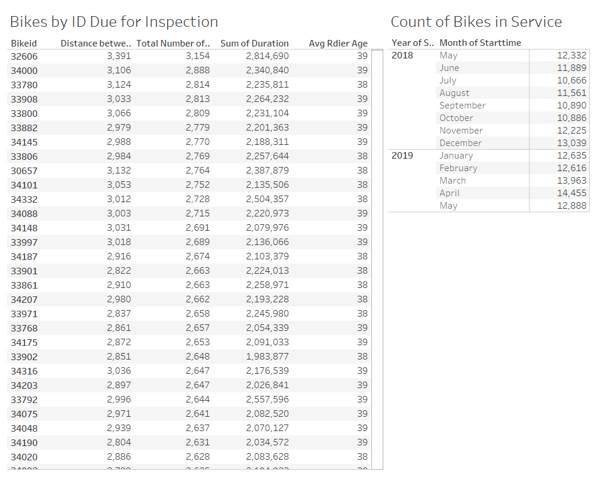

### Age and Gender Analysis

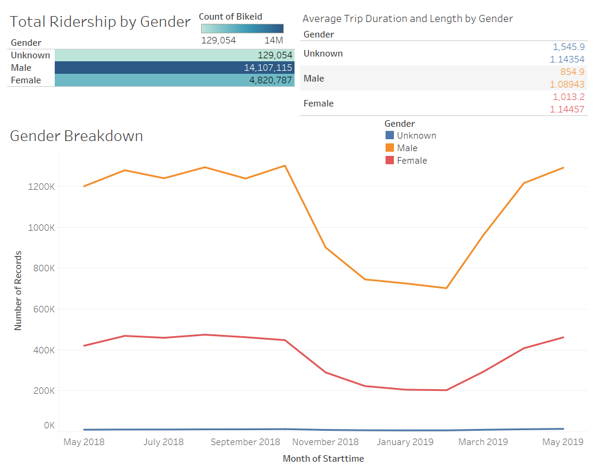
  
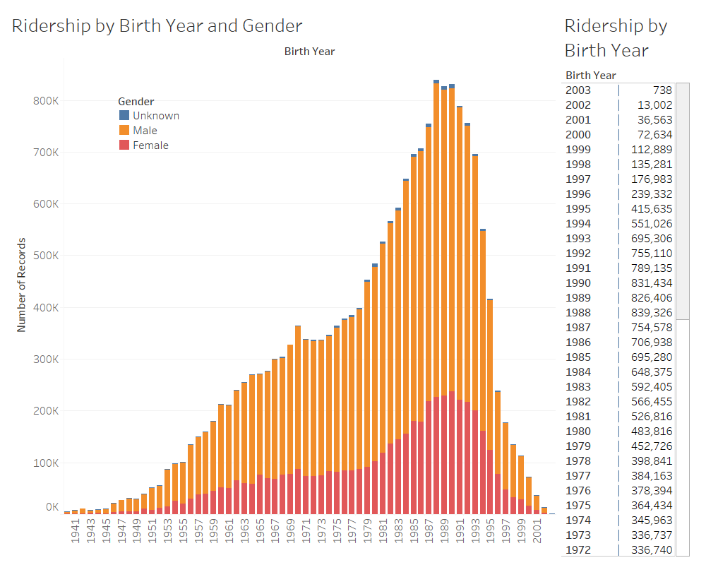
  

### Start Stations and Stop Stations

In the below images you can see a map of the popularity of start and stop stations with CitiBike throughout NYC.  In these images you can discern that the most popular stations to start and stop a CitiBike rider are in the boro of Manhattan.  We can also see a list of the most and least popular stations to start and stop a CitiBike ride.  The least popular stations to start and stop a ride seem to be system stations or on the outskirts of the city.  There is a very large discrepancy between the most and least popular stations in number.

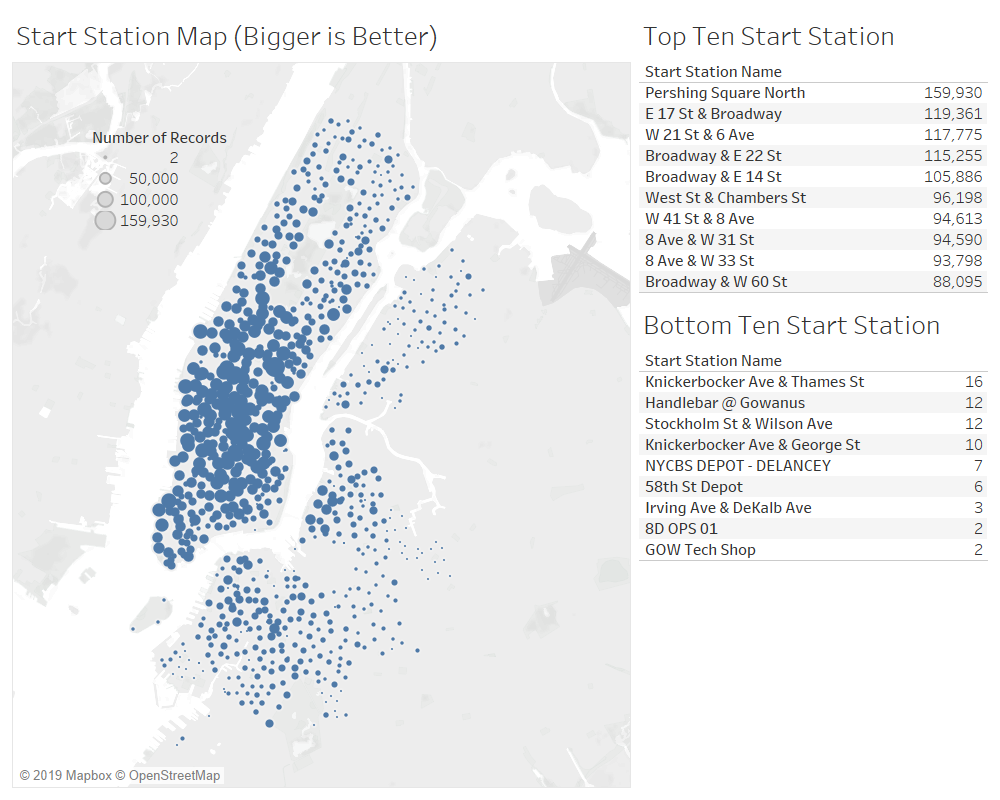

 

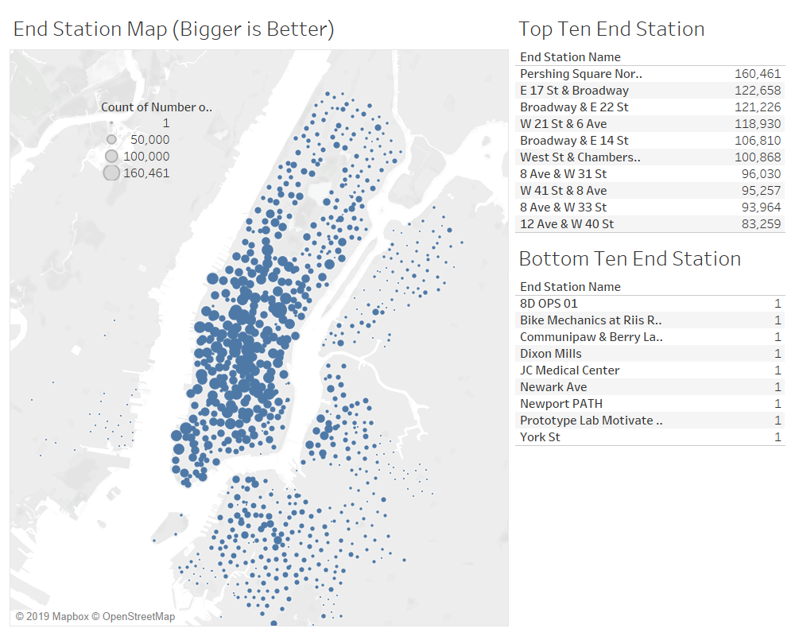

### Peak Riding Hours in Summer and Winter Months
 

In this analysis I was looking to examine the peak riding hours throughout the year.  We were looking to compare the peak riding hours between the summer months and the winter months.  The analysis of the summer months can be seen in the first image below.  This image analyses the months between June and September.  The darker the line gets the higher the ridership gets.  Here you can see that the peak ridership aligns with the AM and PM rush hours at 8 AM and 5 PM.  Prior to finding more conclusions we need to examine the winter ridership.
  
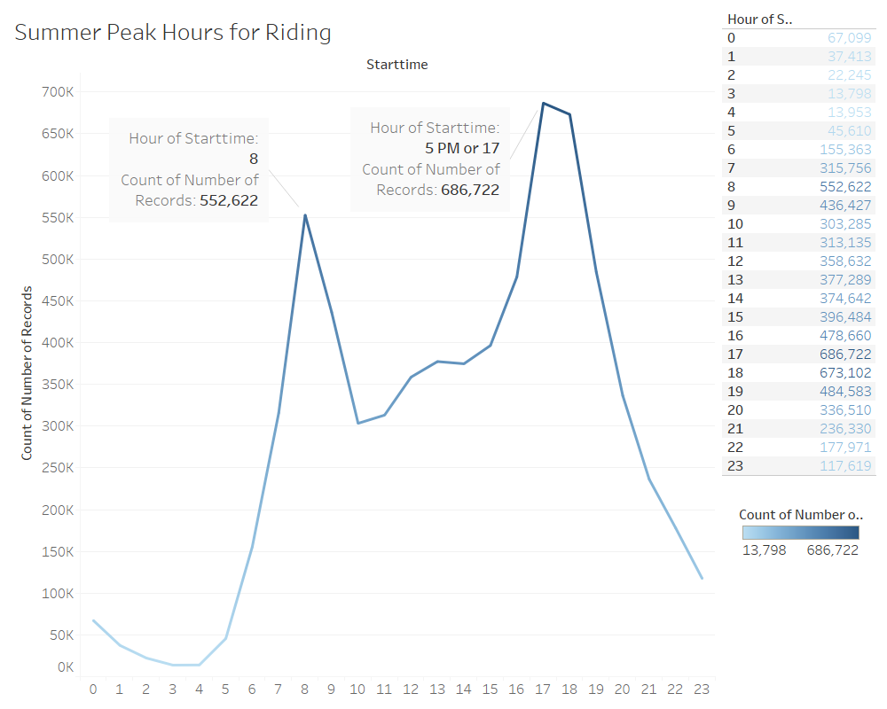

This second image here displays the peak ridership hours in the winter months.  The months surveyed in this image are December to March and uses the same color logic as the above image.  Here you can see that the peak ridership per day in the winter months also coincides with the AM and PM rush hours.  It is worth noting the severe difference in ridership counts in the summer and winter.  The peak ridership in the winter is about half of that in the summer months.  Otherwise, the ridership in the winter and summer months are very similarly shaped.

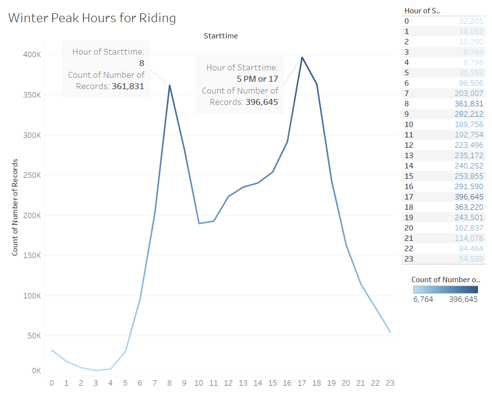

### Unexplained Phenomena

##### Phenomena Number 1 - Unexplained

The first unexplained phenomena I encountered can be seen below.  There is an excess of user registrations of unknown gender totaling about 1,547,272 (as seen in the below image) that have a birth year of 1969.  A possible explanation for this is that this is the default gender and birth year of registrations or what a new registration form auto populates to.
  
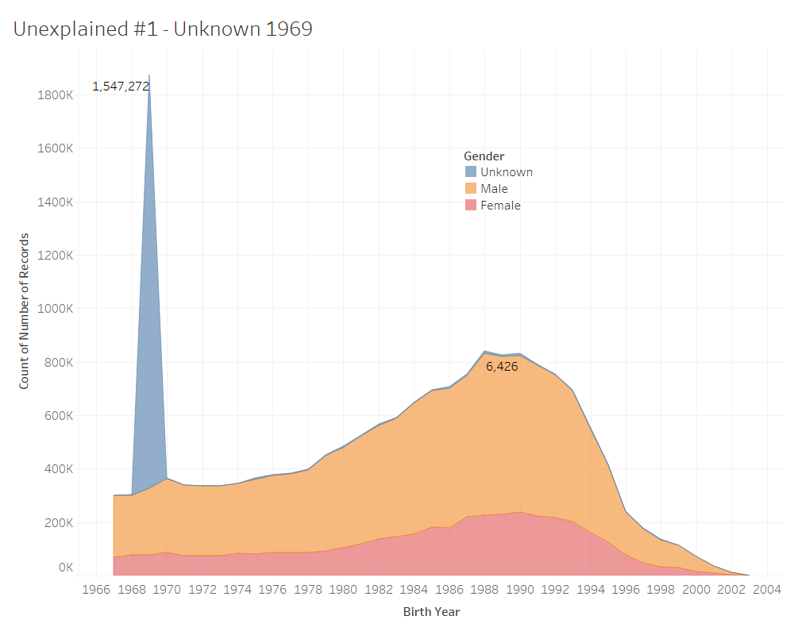

##### Phenomena Number 2 - Unexplained cluster of stations.

In the Bronx there is very little CitiBike ridership.  However, in the images shown below there is a cluster of ridership.  This cluster is in the Bronx around Fordham University.  This cluster is in the middle of a CitiBike drought.  There is no usage around it until Manhattan.  This cluster is not shown in the above images of ridership because there is no other ridership in the Bronx.  Therefore these were assumed to be an unexplained phenomena and not displayed in those above maps.
  
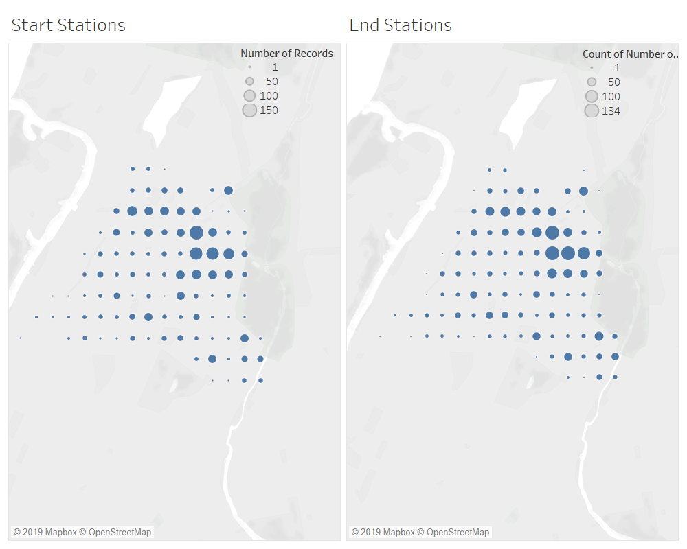
